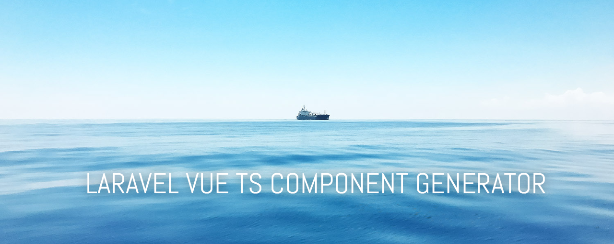

Laravel-Vue-TS-Component-Generator
====================





**Generate vue typescript components.**


## Laravel compatibility

 Laravel  
:---------
 5.5    


## Installation

### Install package

Add the package in your composer.json by executing the command.

```bash
composer require frogbob/laravel-vue-ts-component-generator
```

Next, add the service provider to `app/config/app.php`

```
Frogbob\LaravelVueTSComponentGenerator\LaravelVueTSComponentGeneratorProvider::class,
```


## Generate new component

Just run artisan command in terminal

`php artisan vue:component {component}` 

Just replace {component} with your component name